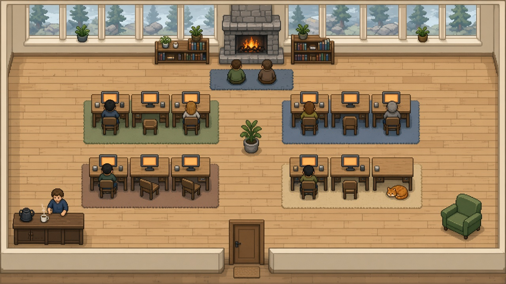

# Cabana Norte — interior do lodge

> **Decisão final (29 set 2026, substitui o texto abaixo onde ele diverge).** O app **abre dentro** da cabana. A sala tem **24×18 tiles** (384×288 px), não 40×24. Para sair, clique na porta ou aperte Escape. De volta no pátio, clique no lodge. **Só Tiny Farm** no runtime: sem monitor custom, sem cadeira ou lareira feitas à mão, sem pixel do conceito. Prova: `cabin-1x.png`. Layout: `src/renderer/office/cabin-layout.ts`.

Esboço de 29 set 2026. Não muda domínio nem reducer. Não entra neste passe de chão e árvore.

A imagem ao lado é **planta**, não trava de pixel. O pixel de produção continua o recorte do Tiny Farm (paleta do pack) mais o monitor custom. A imagem não se traça para o app.

## Decisão

O lodge de fora (`LODGE` 49–68 × 9–24, 20×16 tiles) vira **casca fechada**. A sala de trabalho é outra cena, **40×24 tiles** (640×384 px). Numa janela de 1280×800 o fit inteiro cai em **2×** (1280×768). No pátio de 80×45 o fit fica em 1×, e um cluster de 2×2 some — a sala aconchegante não se lê ali.

Doze mesas em fila dentro de 20×16 é cubículo. Quatro ilhas de três, com chão entre elas, cabem na sala maior. A casca no mapa continua do tamanho do lodge atual.

## 1. A sala

Uma cabana, um cômodo, luz do norte. Sem divisória, sem baia, sem texto em monitor.

| Faixa | Rows | O que é |
| --- | --- | --- |
| Parede norte | 0 | Janelas altas. Lareira no centro. Estantes baixas dos dois lados. |
| Lareira | 1–6 | Fogo, tapete, **4 lugares** sentados de frente para o fogo (cols 16, 18, 20, 22 na row 6). |
| Corredor | 7–8 | Passagem leste–oeste, 2 tiles. |
| Trabalho | 9–15 | **4 ilhas × 3 mesas.** |
| Corredor | 16–17 | Passagem. |
| Sul | 18–22 | Café a oeste, porta no centro, poltrona a leste. |

Ilhas, origem da coluna: **1, 11, 21, 31**. Cada ilha tem 8 tiles de largura. Três mesas `span: 2` com um tile de respiro entre elas. Entre ilhas, 2 tiles de chão e **um vaso** — o vaso é o que impede a leitura de escritório aberto. Quatro tapetes fixos (sálvia, azul-ardósia, barro, areia), um por ilha, não um por pessoa.

Cadeira ao sul da mesa. O consultor senta virado para o norte, como hoje (`facing: 'north'`), de frente para a janela e para o monitor. O monitor continua o nosso: fases `off / booting / working / standby`, sem conteúdo.

**Café** (sudoeste): balcão sólido, chaleira do pack (`Kitchen pot`), **2 lugares em pé**. **Porta** no centro da parede sul: o portal. **Leste:** uma poltrona vazia e a cama do gato. A poltrona não é posto de trabalho.

Lugares de lazer dentro: 4 na lareira + 2 no café. Fora, machado e horta continuam. A fogueira do pátio **permanece acesa como marco**, sem assento.

### O que vem do pack, o que fica nosso

Recorte, não a folha inteira. Nomes medidos no pack, fora do git:

- Chão, parede, janela, cortina: tileset de casa e `Doors, windows and curtains.png`
- Lareira: `Objects/Interior/Fireplace.png`
- Mesa de madeira: `Tables and desks.png` — o tampo. O monitor senta em cima, custom.
- Cadeira: `Chairs.png` ou a cadeira que já é nossa, se o recorte não alinhar o assento.
- Estante, sofá, poltrona: `School.png`, `Sofa and armchair.png`
- Velas: `Candle*.png`
- Gato: `Animals/Pets/Cats` (um sprite parado; sem ciclo se não houver frame útil)
- Café: `Objects/Work Benches/Kitchen pot.png`

Não há monitor no pack. Portão de fora não muda.

## 2. Navegação

Três modelos. Um fica.

| | Clique para entrar | Telhado que some no zoom | Split ou picture-in-picture |
| --- | --- | --- | --- |
| Olhar de 1s | Pátio inteiro. Janelas da casca dizem se há gente trabalhando. | A sala só existe zoomada; no fit 1× é mancha. | Dois focos. O olhar não escolhe. |
| Chegada pela porta | Anda no pátio, cruza a porta, some. Dentro, aparece na porta da sala. | O mesmo grid. Mais simples. | Os dois ao mesmo tempo. A chegada compete com a sala. |
| Pátio vivo | Machado, horta e a fogueira-marco continuam na cena padrão. | Também, mas a sala aberta come o zoom. | O pátio encolhe. |
| Movimento reduzido | Corte seco. | Fade de telhado é o efeito que a preferência pede para desligar. | Sem transição, e mesmo assim dois mundos. |
| Custo | Segunda grade e um portal. Uma simulação só. | Quase nenhum. A planta de 20×16 não cabe. | Duas cenas vivas no mesmo frame. Atenção pior que o custo de draw. |

**Fica o clique.** A planta aconchegante não cabe na casca, e o viewer é olhado, não jogado: a cena padrão tem de ser o mapa inteiro.

### Contrato da cena

- Estado de cena (`yard | lodge`) é do renderer. Zoom e pan não tocam o domínio. Cada cena guarda a própria câmera.
- Abrir o app cai no **pátio**, fit inteiro, como hoje.
- Clique no retângulo `LODGE` entra na sala. A câmera da sala nasce no fit **2×**.
- **Escape**, ou clique na porta de dentro, volta ao pátio. Sem botão novo.
- Hover no lodge: cursor de ponteiro. Sem tooltip.
- Transição: crossfade de **280 ms**. `prefers-reduced-motion`: corte em 0 ms.
- A cena que não está na tela **não entra no stage**. Os personagens das duas zonas continuam no mesmo `PresenceDirector`, desenhados uma vez, na zona em que estão.
- A câmera **não segue** ninguém pelo portal. Quem está olhando escolheu a sala.

### Portal

Um diretor, duas grades.

1. Pátio: a grade de hoje. Células do lodge deixam de ser chão andável. Só o vão da porta (`doorCols` 58–59, `LODGE.bottom`) segue passagem.
2. Sala: grade 40×24. Mesas bloqueiam a fileira do tampo. Cadeira e assento continuam andáveis. Lareira, estante, balcão e paredes bloqueiam. Porta não bloqueia.

Rota que cruza zona: caminho até a porta deste lado, fade curto (**200 ms**; reduzido = snap), continua da porta do outro lado. Chegada completa continua **portão → gatehouse → porta do pátio → porta da sala → mesa**. Reativar **não** repete o portão.

A casca fechada usa recorte de casa do pack no mesmo retângulo 20×16, telhado por cima (`overhead`, como o lintel). As janelas da face sul são o brilho do item 4.1.

## 3. Comportamento

O reducer não muda. `workState` e `ambientEligible` entram no diretor como hoje. Só mudam o waypoint e o tipo de lazer.

| Estado | Onde | Pose | Monitor |
| --- | --- | --- | --- |
| `active` | Mesa estável (`deskIndex` do id, o mesmo hash) | Sentado, norte, bob de teclar se houver movimento | `booting` 500 ms, depois `working` |
| `idle` e ambient | Lazer preferido | Ver abaixo | `off` quando sai da cadeira. `standby` nos 500 ms em que ainda está sentado |
| `stale` | **Onde já está.** Não anda até a lareira. | Congelado, frame 0, alpha de hoje | `standby` se o corpo está na mesa; `off` se a mesa está vazia |
| Chegada | Portão, depois a mesa | Walk do pack, 6 frames | Acende ao sentar |
| Reativar | Do lazer de volta à mesa | Walk. Sem portão | Acende ao sentar |
| Sala vazia | Ninguém inventado | Só o gato no tapete da lareira | Todos `off` |

Colaborador: a regra atual. Mesa própria se houver vaga; se as 12 estiverem cheias, em pé no lazer. Subagente é outro id, outra mesa, o mesmo mapa.

### Lazer

Quatro tipos, nesta ordem de transbordo: `hearth`, `coffee`, `woodpile`, `garden`.

O hash da conversa (não do id do subagente) escolhe o tipo, como `preferredLeisureKind` hoje. Se o tipo está cheio, o próximo da lista. Se todos estão cheios, empilha no preferido — a regra de `assignLeisure` que já existe.

| Tipo | Zona | Vagas | Animação | Papel da fogueira antiga |
| --- | --- | --- | --- | --- |
| `hearth` | Sala | 4, sentado de frente ao fogo | Sentar do pack, 1 frame. Sem teclar | **Substitui os assentos** da fogueira |
| `coffee` | Sala | 2, em pé no balcão | Idle em pé. Vapor é prop, não pose | — |
| `woodpile` | Pátio | 2 | Machado, 6 frames | — |
| `garden` | Pátio | 3 | Enxada ou regador | — |

Metade do idle tende a ficar fora (machado, horta). A outra metade fica na lareira ou no café. O pátio não esvazia, e a sala não vira só mesa.

A fogueira do pátio segue animando, como cenário. Ninguém patha até ela.

`stale` não escolhe lazer e não caminha. Se ficou stale na mesa, dorme no teclado com o monitor em standby. Se ficou stale na horta, congela na horta. Mentir um passeio até o fogo quebraria “observado > inferido > ambient”.

Reduced motion e stale: `leisureFrameIndex(..., play: false)` continua no frame 0.

### Gato

Um. Não é consultor.

- Sem ninguém na sala, ou com todo mundo sentado: tapete da lareira.
- Se há mesa vazia (o dono está em lazer, não stale): a de menor `deskIndex`. Não pula de mesa a cada tick.
- Nunca em cadeira ocupada.
- Reduced motion: sprite parado.

## 4. Delícias

Impacto primeiro. Nenhuma lê prompt. Nenhuma muda lease.

1. **Janelas da casca.** No pátio, a face sul acende pelo que os monitores já sabem: `working`/`booting` aceso, `standby` âmbar fraco, `off` apagado. Três degraus, não doze pontos: 0 apagado, 1–4 uma janela, 5–8 metade, 9–12 todas. É o que torna o clique honesto — o olhar de 1s responde “tem gente trabalhando?” sem entrar.
2. **Dia e noite pelo relógio do Mac.** Leitura a cada minuto, só no renderer. De dia a luz entra pelas janelas do norte. De noite o chão desce um tom e quem carrega a sala é lareira, vela e monitor. Lá fora o brilho da janela pesa mais. Personagem não se move por causa da hora.
3. **O gato na mesa vazia.** Regra da seção 3. Um sprite.
4. **Vapor da caneca** no café. Loop de 2 frames. Reduced motion: um puff parado.
5. **Derrame do monitor no tampo**, só fase `working`, só de noite. Um retângulo quente de poucos pixels na madeira, não um bloom.
6. **Fumaça da chaminé** quando há alguém em `hearth`. A fogueira do pátio continua com a chama própria, o dia inteiro.
7. **Velas da lareira**, 2 frames. Param com reduced motion.
8. **Capacho.** Um frame afundado enquanto um pé cruza a porta. Some no reduced motion.

## 5. O que não fazer neste passe

- Não abrir a sala por hover.
- Não seguir o consultor com a câmera.
- Não pôr as 12 mesas de volta no chão do pátio.
- Não animar stale.
- Não escrever na tela do monitor.
- Não publicar folha do Tiny Farm. Crédito EmanuelleDev segue o mapa de integração.

## Perguntas abertas

1. A cena que abre com o app é o **pátio** (recomendado: chegada e janelas) ou a **sala** (rostos e monitores sem clique)?
2. A fogueira de fora fica **só cenário** (recomendado) ou ainda guarda assentos de idle?
