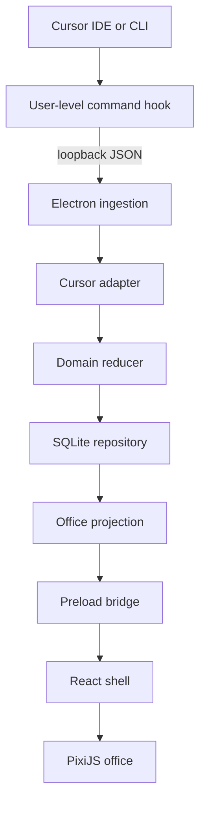
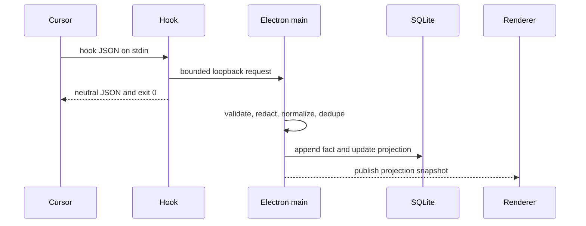
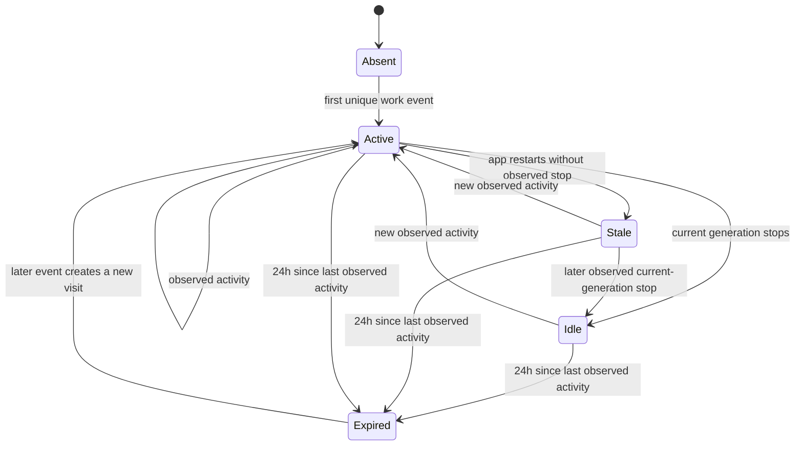

# Cursor Office Visualizer - Plan

## Goal Capsule

- **Objective:** Build a macOS desktop office that turns observed local Cursor agent activity into truthful NPC movement and state.
- **Primary actor:** A professional who keeps agent sessions working and wants to understand their state at a glance.
- **Product authority:** Observed Cursor events override inferred state; inferred state overrides ambient animation.
- **Execution profile:** Greenfield Electron application with one Cursor adapter, one office scene, and local-only data.
- **Stop conditions:** Do not claim Cloud Agent coverage, capture work content, control Cursor, or add a generic plugin framework.
- **Tail ownership:** Future source adapters must emit the same canonical event contract without importing source payloads into the office domain.

---

## Product Contract

### Summary

The MVP is a macOS desktop office that stays open while the user works in Cursor.
Each local Cursor conversation appears as a temporary consultant NPC.
Observed work makes the consultant active, completed turns make it idle, and 24 hours without observed activity removes it from the office.

### Problem Frame

Agent work is spread across conversations and tool streams that require active inspection.
The user wants an ambient view that communicates activity without becoming another chat client.
The visualization must remain honest when Cursor delivers duplicate, delayed, missing, or incomplete events.

### Actors

- A1. **Agent operator:** Uses local Cursor IDE or CLI sessions and watches the office.
- A2. **Consultant NPC:** Represents one Cursor conversation across multiple turns.
- A3. **Collaborator NPC:** Represents a subagent spawned by a consultant.

### Requirements

**Office experience**

- R1. The app displays one consultant NPC for each locally observed Cursor conversation.
- R2. Observed source events control work state and work movement; ambient behavior must never present itself as observed work.
- R3. An idle consultant may walk, rest, play, or socialize without extending its retention window.
- R4. The MVP ships with one office skin and runs as a macOS desktop application.
- R5. The app is viewer-only and cannot send prompts, approvals, follow-ups, or commands to Cursor.

**Lifecycle**

- R6. The first valid work event for an absent conversation creates a consultant. Startup may restore a retained consultant that is still within its 24-hour lease; activity after expiry creates a new visit.
- R7. A current-generation completion signal moves a consultant from active to idle.
- R8. New observed activity before expiry returns an idle consultant to active.
- R9. A consultant leaves exactly 24 hours after its last unique observed source activity.
- R10. Closing and reopening the app restores retained consultants from local state and applies expiry before rendering.
- R11. A collaborator appears with its parent consultant, leaves on an observed stop, and expires after a bounded fallback when its stop is missing.

**Truth and privacy**

- R12. Each displayed state has provenance of observed, inferred, or ambient. Unknown liveness is shown as stale, never as observed work or observed idle.
- R13. Duplicate events do not refresh activity or create duplicate NPCs.
- R14. Unknown, malformed, late, or out-of-order events degrade safely without inventing work.
- R15. Persisted observed-event data excludes prompts, responses, thoughts, commands, tool input/output, file content, email, and transcript paths.
- R16. Activity that occurs while the app is closed is not reconstructed or claimed as observed in the MVP.

**Setup and operations**

- R17. Onboarding installs a user-level Cursor observer without overwriting unrelated hooks.
- R18. Observer failure, timeout, invalid input, or an unavailable app cannot block or modify Cursor.
- R19. The app reports observer health and can remove only the hook entries and local data it owns.
- R20. The MVP observes local Cursor IDE and CLI sessions only; managed Cloud Agents are unsupported.
- R21. Multiple consultants are distinguishable without exposing work content, using a stable local label and visual accent derived from source and conversation identity.

### Key Flows

- F1. **Connect Cursor**
  - **Trigger:** A1 opens the app for the first time.
  - **Steps:** The app inspects current user hooks, previews its additive change, installs the observer, and validates delivery with a harmless local check.
  - **Outcome:** The office is ready or clearly reports why observation is unavailable.
  - **Covered by:** R17, R18, R19

- F2. **Observe a consultant**
  - **Trigger:** Cursor emits the first accepted work event for a conversation.
  - **Steps:** The adapter normalizes the event, the domain updates the consultant, and the renderer reflects the projection.
  - **Outcome:** One consultant becomes visibly active without exposing work content.
  - **Covered by:** R1, R2, R6, R12, R15

- F3. **Retain and reactivate**
  - **Trigger:** The current turn stops, or the app restarts with a retained unfinished generation.
  - **Steps:** An observed stop makes the consultant idle; an unfinished restored generation becomes stale/inferred. Idle consultants may perform ambient behavior, and either state returns to active if another unique source event arrives.
  - **Outcome:** The same consultant remains present across turns.
  - **Covered by:** R3, R7, R8, R13

- F4. **Expire a consultant**
  - **Trigger:** The 24-hour lease reaches its deadline.
  - **Steps:** The app removes the consultant from the live floor while preserving only the bounded local records required by this plan.
  - **Outcome:** The office no longer shows stale consultants.
  - **Covered by:** R9, R10

### Key Decisions

- **Cursor is the first source.** (session-settled: user-directed — chosen over leaving the first source open: personal Cursor hooks expose real local activity now.) Governs R1, R6, R17, R20.
- **Temporary runtimes appear as visitors.** (session-settled: user-directed — chosen over portraying every agent as permanent: the visual lifecycle must preserve the source lifecycle.) Governs R6, R9, R11.
- **Consultants remain for 24 hours after observed activity.** (session-settled: user-directed — chosen over immediate departure when a turn stops: a consultant should wait and become active again on the next message.) Governs R7, R8, R9, R10.
- **The MVP is a viewer, not a replacement client.** (session-settled: user-approved — chosen over in-app conversation: keeping interaction in Cursor makes the first product smaller and read-only.) Governs R2, R5, R18.
- **The MVP supports one source and one skin on macOS.** (session-settled: user-directed — chosen over multiple sources, themes, and operating systems: the first slice should prove one truthful office.) Governs R4, R20, R21.

### Acceptance Examples

- AE1. **Observed work:** Given no consultant exists, when a valid Cursor tool event arrives, then one active consultant appears with observed provenance.
- AE2. **Idle consultant:** Given a consultant is active, when the current generation emits a successful stop, then the same consultant becomes idle and may begin ambient behavior.
- AE3. **Reactivation:** Given a consultant is idle and has not expired, when a new generation event arrives, then it becomes active without creating a second consultant.
- AE4. **Expiry:** Given the last unique observed activity was 24 hours ago, when the lifecycle clock evaluates the office, then the consultant is absent.
- AE5. **Privacy:** Given a hook payload contains prompt text, file content, and tool output, when it is ingested, then none of those fields reach persistence or the renderer.
- AE6. **Fail open:** Given the app is closed or ingestion fails, when Cursor invokes the observer, then Cursor continues without delay or behavior change.
- AE7. **Existing hooks:** Given unrelated user hooks exist, when Office is installed and removed, then those hooks remain byte-equivalent in meaning and order.
- AE8. **Unknown liveness:** Given a retained consultant was active when the app closed, when the app reopens without a later observed stop, then the consultant is stale with inferred provenance and is not presented as currently working.

### Success Criteria

- One local Cursor conversation can be observed from first work event through idle, reactivation, restart, and 24-hour expiry.
- The office can run during normal Cursor work without adding perceptible delay to agent actions.
- Persisted records contain only allowlisted metadata.
- Existing hook configurations survive install and uninstall.

### Scope Boundaries

**Deferred for later**

- Multiple simultaneous source adapters.
- Claude, OpenClaw, Hermes, Grok Bot, and Cursor-managed Cloud Agents.
- Windows, mobile, tablet, e-ink, multiple skins, and user-created rooms.
- In-app chat, agent creation, orchestration, delegation, analytics, cost tracking, and cloud synchronization.
- Offline event capture while the desktop app is closed.

**Outside this MVP's identity**

- Fabricating work activity when no source event exists.
- Reading Cursor transcripts to fill event gaps.
- Blocking or steering Cursor through hook responses.

---

## Planning Contract

### Key Technical Decisions

- KTD1. **Use Electron Forge, Vite, React, TypeScript, and PixiJS 8.** Electron keeps the main process, installer, domain code, and renderer in one language. PixiJS owns only the animated office canvas.
- KTD2. **Keep one real adapter seam.** Define a small source-neutral event contract and implement only `CursorHookAdapter`; do not build runtime discovery, plugin loading, or adapter registration infrastructure.
- KTD3. **Use a fail-open user-level command hook.** Subscribe only to `beforeSubmitPrompt`, `preToolUse`, `postToolUse`, `postToolUseFailure`, `subagentStart`, `subagentStop`, `afterAgentResponse`, and `stop`. The wrapper sends bounded stdin over loopback only while the app is available, uses an explicit short timeout, never sets fail-closed behavior, and always exits 0 after printing a fixed response selected from the hook name rather than from stdin: `{"permission":"allow"}` for permission hooks, `{"continue":true}` for `beforeSubmitPrompt`, and `{}` for every other subscribed hook. It never emits `followup_message`, `additional_context`, `env`, `updated_input`, or `user_message`.
- KTD4. **Sanitize before persistence.** The main process validates payload size, extracts an allowlist, stamps receipt time, and discards raw payloads before writing to SQLite.
- KTD5. **Treat delivery as lossy and unordered.** A single main-process writer assigns local order, applies bounded deduplication, and never invents missing starts, stops, or tool pairs.
- KTD6. **Separate event facts, lifecycle projection, and animation.** A pure TypeScript reducer owns consultant state; ambient animation reads the projection but cannot mutate source activity or retention.
- KTD7. **Persist a minimal normalized journal and projection in SQLite.** The database stores normalized facts, current occupants, provenance, and lease timestamps. It does not implement a general event-sourcing framework.
- KTD8. **Keep Node privileges out of the renderer.** Electron runs with sandboxing, context isolation, and Node integration disabled. A narrow preload API exposes projections, subscriptions, setup health, and uninstall.
- KTD9. **Do not add an offline spool in the MVP.** (session-settled: user-approved — chosen over background capture: KISS favors an app that observes only while it is the ambient display.) Events missed while closed remain explicitly unobserved per R16.
- KTD10. **Use explicit boundaries only where behavior varies.** The source adapter and clock are MVP interfaces because the canonical contract and deterministic tests require substitution. SQLite persistence and PixiJS rendering remain concrete modules until a second backend or renderer exists.

### High-Level Technical Design

#### Component topology



#### Ingestion sequence



#### Consultant lifecycle



### Event and State Rules

- `conversation_id` is the consultant identity within the Cursor source.
- `generation_id` distinguishes turns and prevents a late stop from idling a newer turn.
- `subagent_id` identifies a collaborator when present; ambiguous stops use a bounded fallback and never alter the parent incorrectly.
- A collaborator stop matches by `subagent_id` when available, then by a known child `conversation_id`, then only when exactly one open collaborator of that type belongs to the parent. Ambiguous stops use the bounded fallback.
- A duplicate fingerprint is a no-op and does not refresh `lastObservedAt`.
- The collector receipt time is authoritative because Cursor payloads do not provide a reliable event timestamp.
- Ambient transitions do not write source facts.
- On startup, the reducer restores projections, applies the 24-hour lease, and changes any retained observed-active generation to stale/inferred before publishing the first frame.

### Output Structure

```text
.
├── package.json
├── forge.config.ts
├── tsconfig.json
├── vite.main.config.ts
├── vite.preload.config.ts
├── vite.renderer.config.ts
├── resources/
│   └── cursor-hook.sh
├── src/
│   ├── domain/
│   │   ├── events.ts
│   │   ├── lifecycle.ts
│   │   └── office-reducer.ts
│   ├── main/
│   │   ├── cursor/
│   │   ├── ingestion/
│   │   ├── storage/
│   │   └── index.ts
│   ├── preload/
│   │   └── index.ts
│   └── renderer/
│       ├── App.tsx
│       └── office/
└── tests/
    ├── contract/
    ├── integration/
    └── e2e/
```

### Risks and Mitigations

- **Hook latency affects Cursor.** Keep the wrapper bounded, fail-open, loopback-only, and independent of database work.
- **Hook schema can drift.** Ignore unknown fields, retain `cursor_version`, and test against current official fixtures plus captured allowlisted metadata.
- **Existing hook configuration can be damaged.** Parse and validate before changes, create a backup, merge only owned entries, and abort on unknown structure.
- **Sensitive work can leak.** Enforce an allowlist before logs, database writes, IPC, or diagnostics.
- **Local processes can forge ingestion.** Generate a distinct cryptographically random token per install, store it in app user data with mode `0600`, read it from the wrapper without putting it in argv, bind only to `127.0.0.1`, authenticate before JSON parsing, cap the request body, and never log token or body.
- **Events can duplicate or reorder.** Deduplicate at the single writer and use generation-aware transitions.
- **The visual layer can imply false work.** Keep observed, inferred, and ambient provenance in the projection and expose it to UI diagnostics.
- **Native SQLite packaging can fail.** Verify packaged-app database access early and configure Electron Forge for the selected SQLite dependency.

### Assumptions

- Cursor personal plans continue to support user-level command hooks with schema version 1.
- macOS provides the system shell and loopback networking required by the observer wrapper.
- The app is open while the user expects live observation.
- Source silence never implies idle. An observed current-generation `stop` creates idle; a restart with an unfinished generation creates stale/inferred; a missing stop otherwise leaves the consultant active until its lease expires.
- An unmatched collaborator expires after 30 minutes without refreshing the parent's 24-hour lease.

### Sources and Research

- Cursor Hooks reference: <https://cursor.com/docs/hooks>
- Cursor third-party hook mapping: <https://cursor.com/docs/reference/third-party-hooks>
- Electron security and process model: <https://www.electronjs.org/docs/latest/tutorial/security>
- Electron application data guidance: <https://www.electronjs.org/docs/latest/api/app>
- PixiJS 8 Application and Assets documentation: <https://pixijs.com/8.x/guides/components/application>

---

## Implementation Units

### U1. Establish the secure desktop shell

- **Goal:** Create the Electron application, secure process boundaries, package scripts, and one launchable macOS window.
- **Requirements:** R4, R5
- **Dependencies:** None
- **Files:** `package.json`, `forge.config.ts`, `tsconfig.json`, `vite.main.config.ts`, `vite.preload.config.ts`, `vite.renderer.config.ts`, `src/main/index.ts`, `src/preload/index.ts`, `src/renderer/App.tsx`, `tests/e2e/app-launch.spec.ts`
- **Approach:** Scaffold Electron Forge with Vite and React. Enable sandboxing and context isolation. Disable renderer Node integration. Expose no Cursor controls.
- **Execution note:** This unit is mostly scaffold and security configuration; prove it first with a packaged-app smoke test.
- **Patterns to follow:** Electron process isolation and narrow `contextBridge` APIs.
- **Test scenarios:**
  - Launch the development app and show one renderer window without Node globals.
  - Package the macOS app and launch the packaged artifact.
  - Attempt an unapproved IPC channel and verify the preload bridge does not expose it.
- **Verification:** The signed-or-local packaged app starts, renders the shell, and keeps privileged APIs in the main process.

### U2. Define canonical facts and consultant lifecycle

- **Goal:** Implement the source-neutral event contract and deterministic consultant/collaborator reducer.
- **Requirements:** R6-R14, AE1-AE4, AE8
- **Dependencies:** U1
- **Files:** `src/domain/events.ts`, `src/domain/lifecycle.ts`, `src/domain/office-reducer.ts`, `tests/contract/office-reducer.test.ts`, `tests/contract/lifecycle.test.ts`
- **Approach:** Model observed facts, inferred transitions, ambient eligibility, provenance, deduplication keys, current generation, parent-child relationships, and lease timestamps as pure TypeScript.
- **Execution note:** Implement the state machine test-first with a fake clock.
- **Patterns to follow:** Pure reducer, injected clock, exhaustive discriminated unions, no Cursor hook names outside the adapter.
- **Test scenarios:**
  - Covers AE1. The first unique work fact creates one active consultant.
  - Covers AE2. A stop for the current generation moves the consultant to idle.
  - A late stop for an older generation leaves the newer generation active.
  - Covers AE3. New activity reactivates the same consultant.
  - Covers AE4. Lease evaluation removes a consultant at 24 hours.
  - Ambient activity and duplicate facts do not refresh the lease.
  - A collaborator joins its parent and leaves on a matching stop.
  - A documented `subagentStop` without `subagent_id` closes only an unambiguous collaborator; otherwise the collaborator expires after the fallback deadline.
- **Verification:** All transitions are deterministic under a fake clock and independent of renderer state.

### U3. Add minimal local persistence

- **Goal:** Persist normalized facts and current projections without retaining work content.
- **Requirements:** R9, R10, R13-R16, AE4, AE5
- **Dependencies:** U2
- **Files:** `src/main/storage/database.ts`, `src/main/storage/event-repository.ts`, `src/main/storage/projection-repository.ts`, `tests/integration/storage.test.ts`
- **Approach:** Keep SQLite access in the main process. Use a small schema for normalized facts, dedupe fingerprints, occupants, provenance, and lease timestamps. Apply migrations transactionally.
- **Patterns to follow:** Repository boundary, single writer, prepared statements, atomic fact-and-projection updates.
- **Test scenarios:**
  - Covers AE5. Sensitive fixture fields never appear in database pages or diagnostic output.
  - Duplicate fingerprints produce one fact and one projection update.
  - Restart filters expired consultants and converts retained unfinished generations to stale/inferred before publishing.
  - A failed transaction leaves fact and projection unchanged.
  - Unknown event kinds do not mutate projections.
- **Verification:** A fresh and migrated database reconstruct the same office projection from normalized data.

### U4. Install and ingest Cursor hooks safely

- **Goal:** Observe local Cursor IDE and CLI work without blocking Cursor or damaging existing hooks.
- **Requirements:** R17-R20, AE6, AE7
- **Dependencies:** U1, U2, U3
- **Files:** `resources/cursor-hook.sh`, `src/main/cursor/hook-config.ts`, `src/main/cursor/hook-installer.ts`, `src/main/cursor/cursor-adapter.ts`, `src/main/ingestion/server.ts`, `tests/contract/cursor-adapter.test.ts`, `tests/integration/hook-installer.test.ts`, `tests/integration/ingestion.test.ts`
- **Approach:** Install one owned command per subscribed generic event in the Cursor user hook configuration. Generate a per-install token under app user data with mode `0600`; the wrapper reads it without exposing it in argv. It forwards bounded stdin to a `127.0.0.1` endpoint and always prints KTD3's fixed event-safe response. The wrapper never writes stdin or token data to files, stderr, argv, or diagnostics. The main process authenticates before JSON parsing, validates size, allowlists fields, normalizes, deduplicates, and persists.
- **Execution note:** Start from captured official-schema fixtures, then validate one live personal-account session.
- **Patterns to follow:** Additive configuration merge, owned marker, backup-before-write, atomic replacement, fail-open observer.
- **Test scenarios:**
  - Fresh install creates valid schema-version-1 entries.
  - Covers AE7. Install and uninstall preserve unrelated hook entries.
  - Invalid or unknown hook configuration aborts without writing.
  - Covers AE6. App unavailable, timeout, malformed stdin, and connection failure print the exact event-specific response from KTD3 and exit 0.
  - Missing or invalid tokens are rejected before parsing and cannot create office state.
  - Oversized payloads are rejected before parsing or persistence.
  - Prompt, response, thought, command, file, email, transcript, token, and raw-body fixture strings never reach wrapper artifacts, stderr, logs, SQLite, IPC, or diagnostics.
  - IDE and CLI fixtures map to the same canonical facts.
  - Cloud-only or unsupported events are ignored.
- **Verification:** Cursor's Hooks view reports loaded commands, a local test reaches the app, and unrelated hooks remain operational.

### U5. Build the office projection and PixiJS scene

- **Goal:** Render consultants and collaborators as a living office without coupling animation to source semantics.
- **Requirements:** R1-R4, R11, R12, R21
- **Dependencies:** U2, U3
- **Files:** `src/renderer/office/OfficeCanvas.tsx`, `src/renderer/office/scene.ts`, `src/renderer/office/consultant-view.ts`, `src/renderer/office/ambient-director.ts`, `src/renderer/office/assets.ts`, `tests/contract/office-projection.test.ts`, `tests/e2e/office-scene.spec.ts`
- **Approach:** Initialize one PixiJS application inside a React-owned canvas boundary. Convert domain projections into scene commands. Use the Pixi ticker for movement, but use the domain clock for lifecycle.
- **Experience defaults:** The office is the full-window primary view. Each consultant receives `Consultant · <stable 4-character suffix>` and a stable accent color; collaborators are visually grouped near their parent and labeled by collaborator type. A small badge distinguishes observed, inferred/stale, and ambient state. With zero consultants, render the furnished ambient office and a non-work “Waiting for Cursor activity” cue.
- **Patterns to follow:** React owns mount/unmount; Pixi owns sprites and ticker; render derived booleans instead of subscribing components to raw events.
- **Test scenarios:**
  - Active, idle, stale/inferred, ambient, and collaborator projections render distinct truthful states.
  - Two consultants remain distinguishable without exposing conversation content.
  - A collaborator appears near its parent and leaves without changing the parent's state.
  - A connected office with zero consultants renders a waiting state without invented occupants.
  - An idle consultant selects ambient behavior without changing domain timestamps.
  - A reactivated consultant interrupts ambient behavior and returns to a workstation.
  - Removing a projection destroys its sprite and ticker work.
  - Resize maintains a usable office viewport.
- **Verification:** Fixture projections produce stable screenshots and no animation path mutates persisted lifecycle state.

### U6. Complete onboarding, health, and lifecycle UX

- **Goal:** Let the user connect Cursor, understand observation status, and remove the integration safely.
- **Requirements:** R12, R16-R20, F1-F4
- **Dependencies:** U4, U5
- **Files:** `src/preload/index.ts`, `src/renderer/App.tsx`, `src/renderer/onboarding/ConnectCursor.tsx`, `src/renderer/status/ObservationStatus.tsx`, `src/renderer/settings/IntegrationSettings.tsx`, `tests/e2e/onboarding.spec.ts`, `tests/e2e/restart-expiry.spec.ts`
- **Approach:** Expose narrow preload methods for setup preview, install, health, projections, subscriptions, and uninstall. Explain local-only observation and closed-app gaps without showing payload content. Keep a slim persistent status strip over the full-window office; open integration settings in a keyboard-reachable modal. Before install, show the exact hook names, command location, fields retained, and additive configuration change, then request confirmation.
- **Patterns to follow:** Explicit human confirmation before modifying external configuration; observable health states; no raw event IPC.
- **Test scenarios:**
  - First launch explains the change and waits for confirmation.
  - The setup preview names every subscribed hook, retained field, installed command location, and additive configuration edit before confirmation.
  - Successful setup transitions from disconnected to waiting-for-activity.
  - A failed setup leaves Cursor configuration unchanged and gives a recovery action.
  - Restart restores a retained consultant as stale/inferred when no stop was observed, and removes an expired consultant before the first frame.
  - Uninstall removes only Office-owned entries, the mode-`0600` backup and token, and the complete SQLite directory including WAL and SHM sidecars.
  - Observation status distinguishes observed, inferred, ambient, disconnected, and stale states.
  - Shell controls are keyboard reachable, state changes have accessible text, and reduced-motion mode suppresses ambient locomotion while preserving state cues.
- **Verification:** A new user can install, observe one consultant, restart, and uninstall without editing files manually.

### U7. Package and harden the macOS MVP

- **Goal:** Produce a distributable macOS artifact and enforce the full privacy, performance, and regression gates.
- **Requirements:** R1-R21
- **Dependencies:** U1-U6
- **Files:** `forge.config.ts`, `package.json`, `.gitignore`, `README.md`, `tests/e2e/packaged-app.spec.ts`
- **Approach:** Package application assets and hook wrapper, verify SQLite native dependencies, document local data and unsupported surfaces, and add CI-compatible quality scripts.
- **Execution note:** Prefer install/runtime smoke proof over adding abstractions for future platforms.
- **Patterns to follow:** Reproducible packaging, least-privilege renderer, explicit unsupported-feature documentation.
- **Test scenarios:**
  - Packaged app installs its wrapper from the final resource location.
  - Packaged app receives a hook event and renders the consultant.
  - Removing or moving the app leaves the wrapper fail-open.
  - A burst of duplicate and out-of-order events does not freeze Cursor or the renderer.
  - Database and logs contain no sensitive fixture strings.
- **Privacy teardown:** Store the pre-write hooks backup only under app user data with mode `0600`, never beside Cursor configuration. Uninstall deletes that backup, token, database, WAL, SHM, and Office-owned wrapper after removing only Office-owned hook entries.
- **Verification:** The distributable completes the end-to-end acceptance flow on a clean macOS user profile.

---

## Verification Contract

| Gate | Command | Covers | Done signal |
|---|---|---|---|
| Static quality | `npm run lint` | U1-U7 | No lint violations |
| Types | `npm run typecheck` | U1-U7 | Main, preload, renderer, and tests compile |
| Domain contracts | `npm test` | U2-U5 | Lifecycle, privacy, dedupe, and projection scenarios pass |
| Integration | `npm run test:integration` | U3, U4 | SQLite, installer, and ingestion tests pass |
| Desktop end-to-end | `npm run test:e2e` | U1, U5-U7 | Onboarding, observed activity, restart, expiry, and uninstall pass |
| Package smoke | `npm run make` | U1, U7 | macOS artifact builds and launches |
| Live Cursor proof | Manual on personal Cursor | U4-U7 | One IDE or CLI conversation appears, idles, reactivates, and never blocks Cursor |

---

## Definition of Done

- All R1-R21 requirements have an implementation and a passing verification path.
- All acceptance examples pass against the packaged macOS app where applicable.
- The hook remains fail-open when the app is unavailable, slow, or removed.
- Install and uninstall preserve unrelated user hooks.
- No forbidden payload content exists in SQLite, logs, IPC, screenshots, or diagnostics.
- Work animations are traceable to observed events; inferred and ambient states remain distinguishable.
- A retained consultant restores correctly and leaves at the 24-hour deadline.
- The renderer has no direct Cursor or SQLite dependency.
- The domain has one Cursor adapter and no speculative plugin framework.
- README documents local-only observation, closed-app gaps, Cloud Agent exclusion, privacy boundaries, and uninstall.
- Abandoned experiments, unused abstractions, temporary assets, and debug payload dumps are removed.
